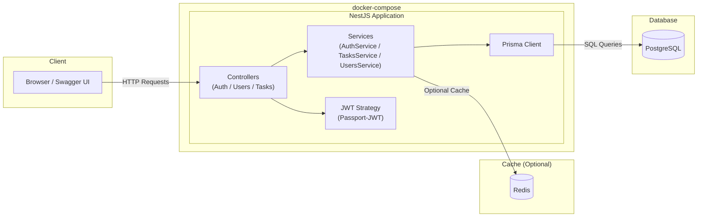

# ✨ Task Manager API (NestJS + Prisma + PostgreSQL + Docker)

A modern, production-ready Task Management API built with **NestJS**, **Prisma ORM**, **PostgreSQL**, **Redis**, and **Docker**.  
JWT 認証、Task CRUD、User 管理、Swagger ドキュメントまで揃ったフルスタックなバックエンドです。

---

## 🚀 Features

- ⚡ **NestJS (Modular Architecture)**
- 🗄️ **Prisma ORM (PostgreSQL)**
- 🔐 **JWT Authentication (Access Token)**
- 🧪 **Task CRUD / User API 完備**
- 🐳 **Docker / docker-compose**
- 📘 **Swagger (OpenAPI UI)**
- 🔄 **Prisma Migrations**
- 🔧 **Redis（オプション）**
- 🛠️ **CI-ready structure**

---

## 📁 Project Structure

```txt
task_management_by_chappy/
│
├── src/
│   ├── main.ts
│   ├── app.module.ts
│   └── modules/
│       ├── auth/
│       │   ├── auth.controller.ts
│       │   ├── auth.service.ts
│       │   ├── jwt.strategy.ts
│       │   └── dto/
│       │       ├── login.dto.ts
│       │       └── signup.dto.ts
│       │
│       ├── tasks/
│       │   ├── tasks.controller.ts
│       │   ├── tasks.service.ts
│       │   └── dto/
│       │       ├── task-create.dto.ts
│       │       └── task-update.dto.ts
│       │
│       ├── users/
│       │   ├── users.controller.ts
│       │   └── users.service.ts
│       │
│       └── prisma/
│           └── prisma.service.ts
│
├── prisma/
│   ├── schema.prisma
│   └── migrations/
│       └── 20251205000000_init/
│           ├── migration.sql
│           └── README.md
│
├── Dockerfile
├── docker-compose.yml
├── package.json
├── package-lock.json
├── tsconfig.json
├── .eslintrc.js
├── .env.example
└── README.md

```

---

# 🛠️ Getting Started

第三者が **git clone → docker compose up → migrate** の 3 ステップで動かせるように設計されています。

---

## 1️⃣ Clone the repository

```bash
git clone https://github.com/hiroyasu12/task_management_by_chappy.git
cd task_management_by_chappy
```

---

## 2️⃣ Create environment file

```bash
cp .env.example .env
```

`.env` の中身はそのままで動作します（必要なら編集してください）。

---

## 3️⃣ Start with Docker

```bash
docker compose up --build
```

- API: http://localhost:3000  
- Swagger: http://localhost:3000/api  

---

## 4️⃣ Apply Prisma migrations（初回のみ必要）

初回はデータベースが空のため、別端末でtask_management_by_chappyにてマイグレーションを適用します：
```bash
docker compose exec app npx prisma migrate deploy
```

**✔ 2 回目以降は不要（DB は volume に保持されるため）**  
**✔ docker compose up だけで起動できます**

---

# 📘 API Documentation (Swagger)

起動後アクセス：

👉 **http://localhost:3000/api**

Swagger の “Authorize” で次の形式で JWT をセット：

```text
&lt;access_token&gt;
```

---

# ✨ Usage Guide

---

## 1. Signup

**POST /auth/signup**

```json
{
  "email": "john@example.com",
  "password": "pass1234",
  "name": "John"
}
```

---

## 2. Login（JWT取得）

**POST /auth/login**

```json
{
  "email": "john@example.com",
  "password": "pass1234"
}
```

レスポンス例：

```json
{
  "accessToken": "xxxxx.yyyyy.zzzzz",
  "refreshToken": "TODO-refresh-token"
}
```

Swagger の Authorize に貼り付け：

```text
Bearer xxxxx.yyyyy.zzzzz
```

---

## 3. Create Task（JWT 必須）

**POST /tasks**

```json
{
  "title": "My first task",
  "description": "Simple task"
}
```

---

## 4. Other Task Operations

| Method | Endpoint      | Description      |
|--------|---------------|------------------|
| GET    | /tasks        | Get my tasks     |
| GET    | /tasks/:id    | Get task detail  |
| PUT    | /tasks/:id    | Update task      |
| DELETE | /tasks/:id    | Delete task      |

---

# 🧪 Test API via curl (optional)

```bash
curl -X POST http://localhost:3000/tasks \
  -H "Authorization: Bearer &lt;TOKEN&gt;" \
  -H "Content-Type: application/json" \
  -d '{"title":"From curl"}'
```

---

# 🗄️ Database Access (psql)

```bash
docker compose exec db psql -U postgres -d taskdb
```

---

# 🛑 Stopping & Resetting

停止：

```bash
docker compose down
```

DB も消したい場合：

```bash
docker compose down -v
```

---

# 🔒 Production Notes

- 本番では **強力な JWT_ACCESS_SECRET を必ず使用**
- Docker イメージは **マルチステージビルドで軽量**
- 本番 DB（RDS / Cloud SQL）を使う場合は `.env` の `DATABASE_URL` を変更

---

# 🏗️ Architecture Diagram (Mermaid)

本アプリケーションのアーキテクチャ全体像：




---

# 📄 License

MIT
